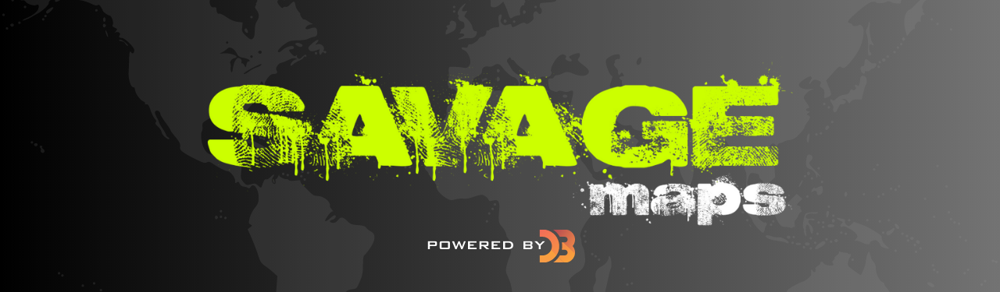
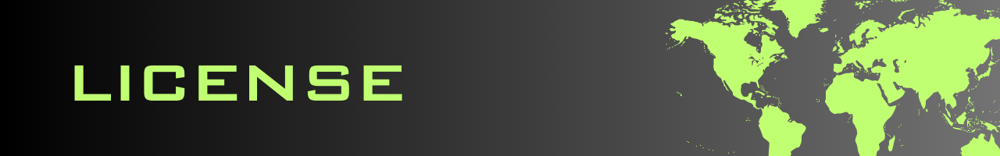
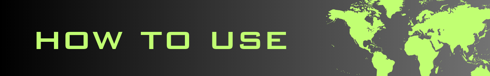
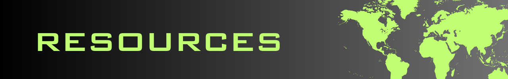
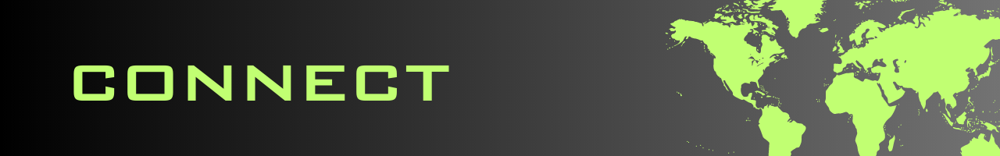

<div id='intro' align='center'>
  
</div>

[SaVaGe Maps](https://savagemaps.com) is where I host my [D3](https://d3js.org)-fueled map exploits. I figured it was finally time to curate a single map resource for future me since most of my side projects go unpublished or end up in an all-too-cliché "private" repo.

Make sure to check out the [Resources](#resources) section of the README for a list of all the different sites, docs, and people that I found useful when trying to put these maps together.

Thanks for checking out the Savage Maps repo. Hopefully, this project helps you build some Savage maps of your own!

<br>

<div id='license' align='center'>
  
</div>

### MIT License (MIT)

Copyright © 2023 Ephraim Smith

Permission is hereby granted, free of charge, to any person obtaining a copy of this software and associated documentation files (the “Software”), to deal in the Software without restriction, including without limitation the rights to use, copy, modify, merge, publish, distribute, sublicense, and/or sell copies of the Software, and to permit persons to whom the Software is furnished to do so, subject to the following conditions:

The above copyright notice and this permission notice shall be included in all copies or substantial portions of the Software.

THE SOFTWARE IS PROVIDED “AS IS”, WITHOUT WARRANTY OF ANY KIND, EXPRESS OR IMPLIED, INCLUDING BUT NOT LIMITED TO THE WARRANTIES OF MERCHANTABILITY, FITNESS FOR A PARTICULAR PURPOSE AND NONINFRINGEMENT. IN NO EVENT SHALL THE AUTHORS OR COPYRIGHT HOLDERS BE LIABLE FOR ANY CLAIM, DAMAGES OR OTHER LIABILITY, WHETHER IN AN ACTION OF CONTRACT, TORT OR OTHERWISE, ARISING FROM, OUT OF OR IN CONNECTION WITH THE SOFTWARE OR THE USE OR OTHER DEALINGS IN THE SOFTWARE.

<div id='how-to-use' align='center'>
  
</div>

### **_Clone the Repo_**

```shellscript
git clone https://github.com/ephcoding/savage-maps.git
```

### **_Nav to Project_**

```shellscript
cd <path/to>/savage-maps
```

### **_Install Packages_**

```shellscript
npm install

OR

yarn
```

### **_Run It_**

```shellscript
npm run dev

OR

yarn run dev
```

<div id='resources' align='center'>
  
</div>

### **_Production_**

`D3.js` | open source JavaScript data visualization library

`next` | React framework

`react` | JavaScript library for creating user interfaces

`react-dom` | React package for working with the DOM

`react-query` | Hooks for managing, caching and syncing asynchronous and remote data in React

### **_Development_**

`jest` | JavaScript test runner

`tailwindcss` | utility-first CSS framework

`postcss` | JavaScript plugins that analyze and transform CSS

<div id='connect' align='center'>
  
</div>

**Email:** [ephraimjsmith@gmail.com](mailto:ephraimjsmith@gmail.com)

**LinkedIn:** [/in/ephraimsmithdev](https://linkedin.com/in/ephraimsmithdev)

**GitHub:** [ephcoding](https://github.com/ephcoding)

**Twitter:** [@ephraimsmithdev](https://twitter.com/ephraimsmithdev)
